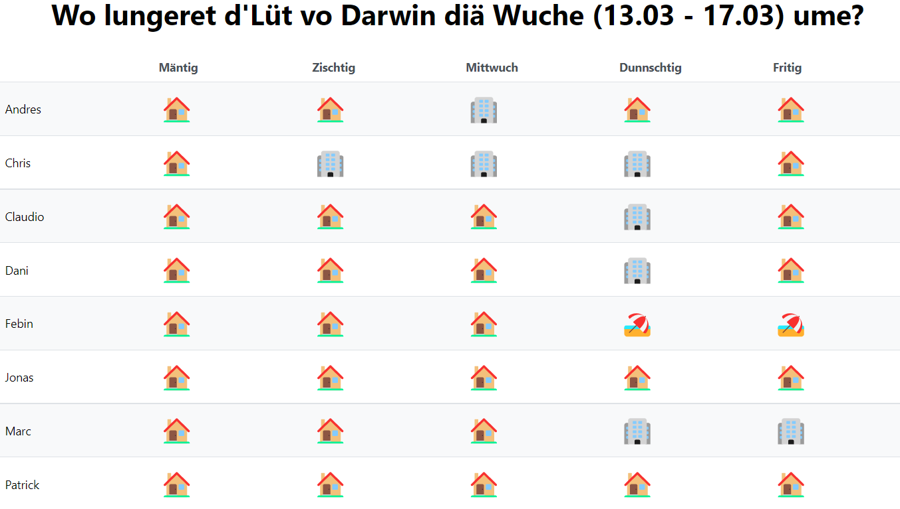

# Who is Where

A simple zero-config web app written with React (CRA) and .NET (HotChocolate [including GraphQL Subscriptions]) which allows a team - in the time of home office & flex desk - to easily see where each member is working from.

## Zero Config? How do I use it!

1. Go to the site (see the url in the top right of github) or start it locally (you'll need a mongo db connection string)
2. Specify the following query params directly in the URL:
   a. `teamIdentifier`: Kind of a sessionId / password for you team, so only people who know the url can view and change the data
   b. `teamName`: The name (display name) for you team
   c. `who`: You can add as many `who` params as you like, each one is the name of one team member, e.g. `who=Patrick`
3. Share the link with your team members (or add it as a custom tabs in teams)
4. You'll get something like this: 
5. ????
6. Profit!
